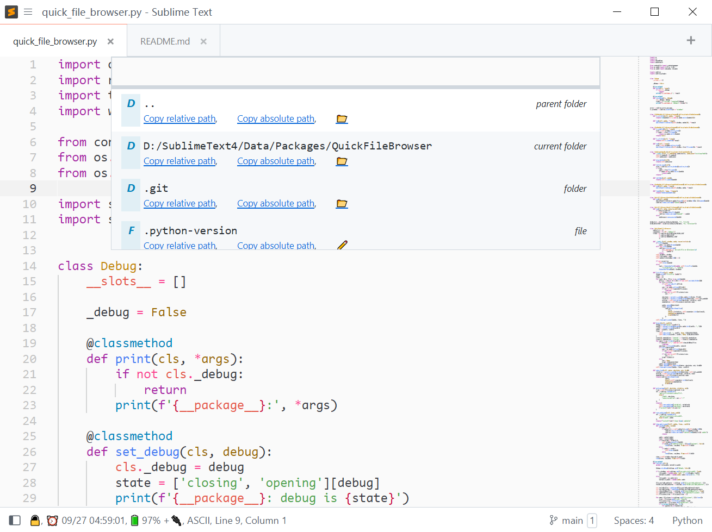
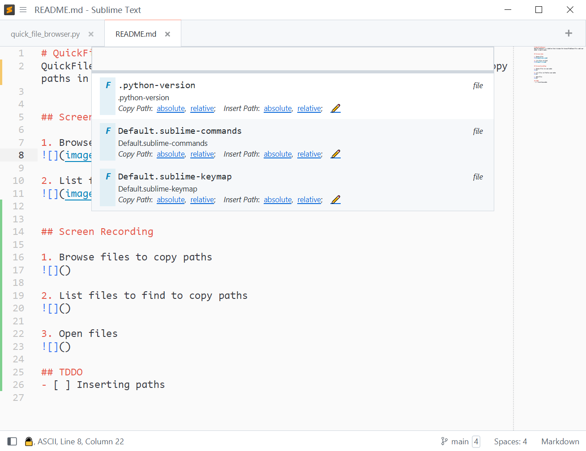

# QuickFileBrowser
QuickFileBrowser is A Sublime Text 4 plugin for browse/find/open files and copy paths in quick panel.

## Screen shots

1. Browse files

2. List files to find

## Screen Recording

1. Browse files to copy paths

2. List files to find to copy paths

3. Open files

## TDDO
- [x] Inserting paths
